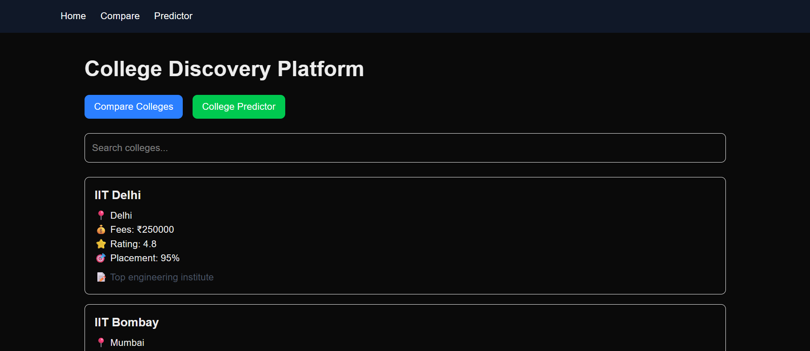
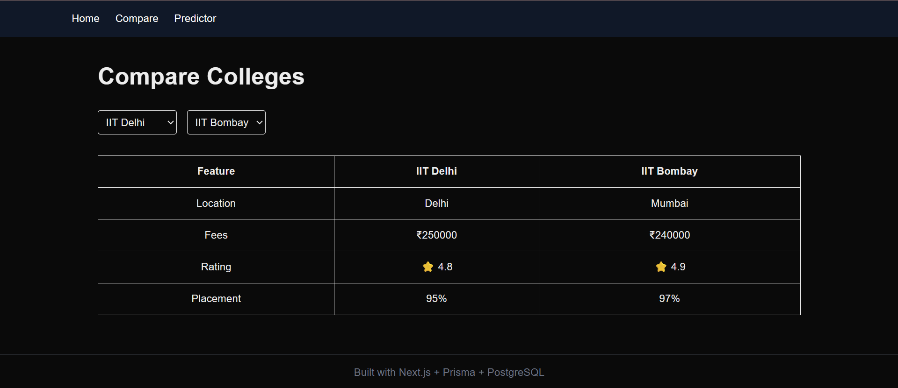
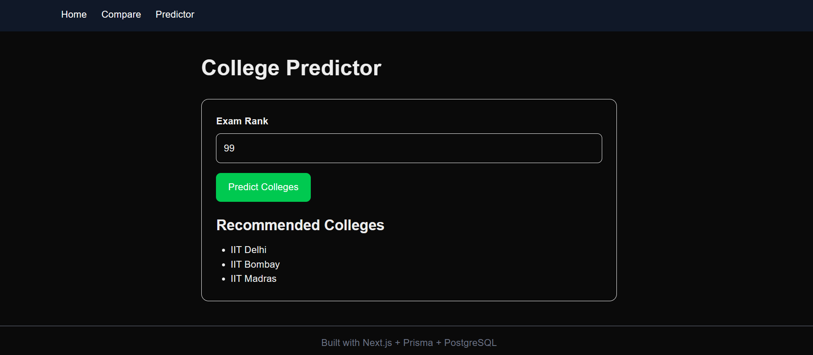

# 🎓 College Discovery Platform

A full-stack web application that helps students discover, compare, and explore colleges based on ratings, fees, placements, and location.

## 🚀 Live Demo

🔗 https://college-discovery-platform-phi-seven.vercel.app/

## 📂 GitHub Repository

🔗 https://github.com/diyasharma22/college-discovery-platform

---

## ✨ Features

### 🏫 College Listings
- Browse colleges with detailed information
- View fees, ratings, placements, and location
- Responsive card-based UI

### 🔍 Search Functionality
- Search colleges by name
- Search colleges by location
- Instant filtering results

### 📊 College Comparison
- Compare multiple colleges side by side
- Evaluate fees, ratings, and placement statistics

### 🎯 College Predictor
- Predict suitable colleges based on user inputs
- Simple recommendation interface

### 📄 College Details Page
- Dedicated page for every college
- Detailed college information

---

## 🛠️ Tech Stack

### Frontend
- Next.js 16
- React 19
- TypeScript
- Tailwind CSS

### Backend
- Next.js API Routes
- Prisma ORM

### Database
- PostgreSQL
- Neon Database

### Deployment
- Vercel

---

## 📁 Project Structure

```bash
src/
├── app/
│   ├── api/
│   │   └── colleges/
│   ├── college/
│   │   └── [id]/
│   ├── compare/
│   ├── predictor/
│   └── page.tsx
│
├── components/
│   ├── Navbar.tsx
│   └── SearchColleges.tsx
│
└── lib/
    └── prisma.ts
```

---

## ⚙️ Installation & Setup

### Clone Repository

```bash
git clone https://github.com/diyasharma22/college-discovery-platform.git
```

### Navigate to Project

```bash
cd college-discovery-platform
```

### Install Dependencies

```bash
npm install
```

### Configure Environment Variables

Create a `.env` file:

```env
DATABASE_URL=your_neon_database_url
```

### Generate Prisma Client

```bash
npx prisma generate
```

### Run Development Server

```bash
npm run dev
```

Open:

```bash
http://localhost:3000
```

---

## 🗄️ Database

The project uses:

- PostgreSQL
- Neon Database
- Prisma ORM

Example College Fields:

- ID
- Name
- Location
- Fees
- Rating
- Placement Percentage
- Description

---

## 📸 Screenshots

### 🏠 Home Page

The homepage allows students to browse colleges, search by name or location, and navigate to comparison and prediction tools.



---

### 📊 Compare Colleges

Compare multiple colleges side-by-side based on fees, ratings, placements, and other important factors.



---

### 🎯 College Predictor

A simple predictor tool that helps students find suitable colleges based on their inputs.



---

## 🌟 Future Improvements

- User authentication
- College reviews and ratings
- Advanced filtering
- Scholarship recommendations
- AI-powered college suggestions
- Bookmark favorite colleges

---

## 👩‍💻 Author

**Diya Sharma**

- GitHub: https://github.com/diyasharma22
- LinkedIn: https://www.linkedin.com/in/diya-sharma-813973324/

---

## 📜 License

This project is created for educational and internship purposes.
